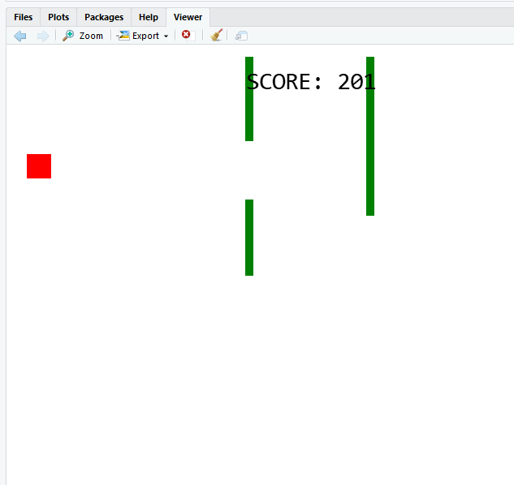

# R Javascript Simple Game

R package that ports a simple JavaScript game into R using htmlwidgets package.

The simple game written in Javascript is taken for the tutorial in the w3.schools.com.
Use the arrows of the keyboard to move the red square and avoid the obstacles.
Visit https://www.w3schools.com/graphics/game_controllers.asp for more details
The purpose of the package is to showcase how to use the htmlwidgets package. 

### Prerequisites

```
install.packages('devtools')
install.packages('roxygen2')
install.packages('htmlwidgets')
```

### Installation

You got the option of:
```
devtools::install_github("grstathis/rjsimplegame")
```

In case you want to extend and develop the package:
```
1- clone the repo
2- Open the Rstudio project file : rjsimplegame.Rproj
3- Build the package
```

### Usage

Load the installed library and run the main function.
```
library(rjsimplegame)
rjgame()
```
You should be able to see the game in the Viewer tab in Rstudio.

Click the widget to make it active and use the keyboard arrows to move the red square.




## Built With

* [Rstudio](http://www.dropwizard.io/1.0.2/docs/) - The development framework used.
* [htmlwidgets](https://maven.apache.org/) - R package to create web components in R.
* [w3school](https://www.w3schools.com/) - Used to get the javascript game code.


## Authors

* **Stathis Grigoropoulos** - *Initial work*


## License

This project is licensed under the MIT License - see the [LICENSE.md](LICENSE.md) file for details
